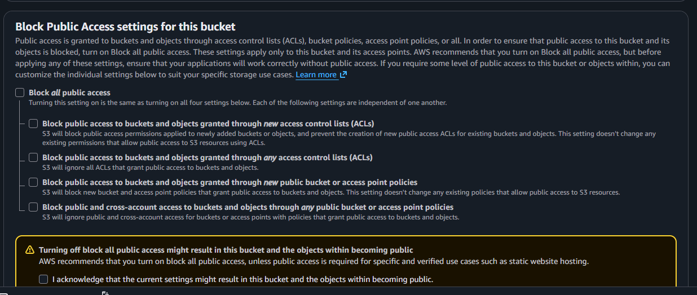
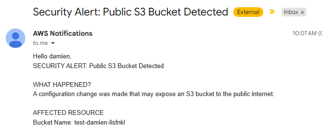

1. log into AWS and navigate to the S3 dashboard.
2. Click the create bucket button
3. Create a unique bucket name. My recomemendation would be to include your account id and region into the bucket.
4. Scroll down, and uncheck 'Block all public access' and check the acknowledge box.
   
5. Scroll all the way to the bottom and click Create Bucket.
6. Within a couple of seconds, you should have received an email for the detected public S3 bucket.
   

You're done.