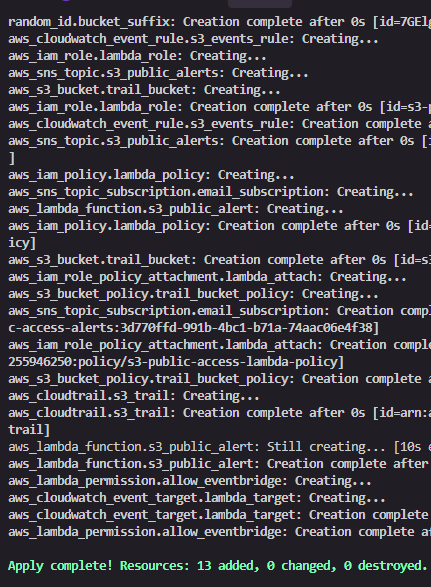
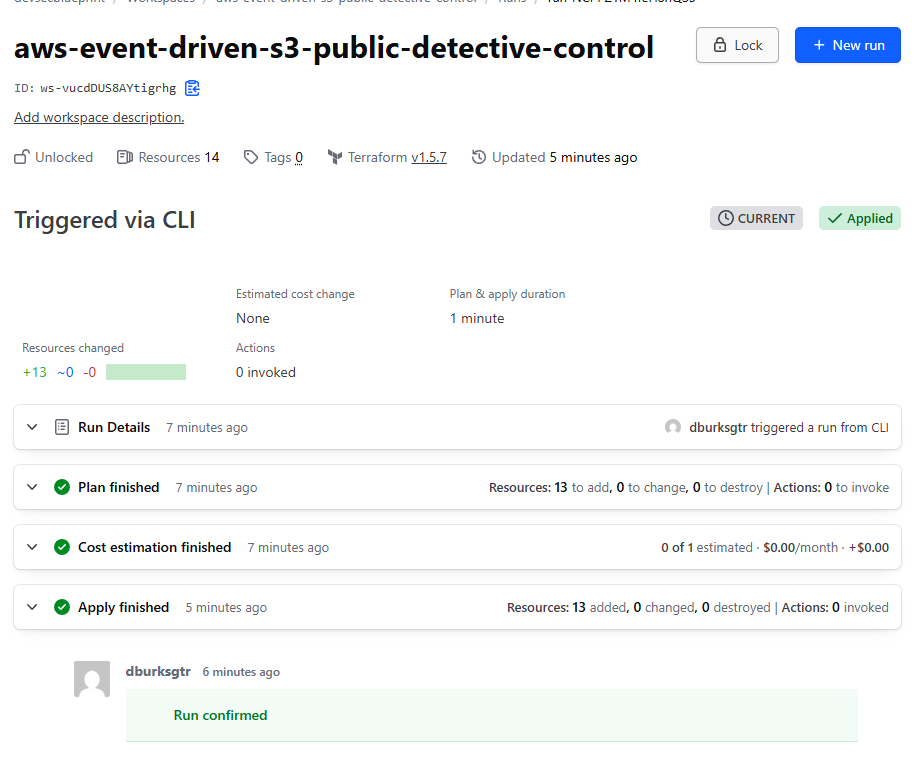
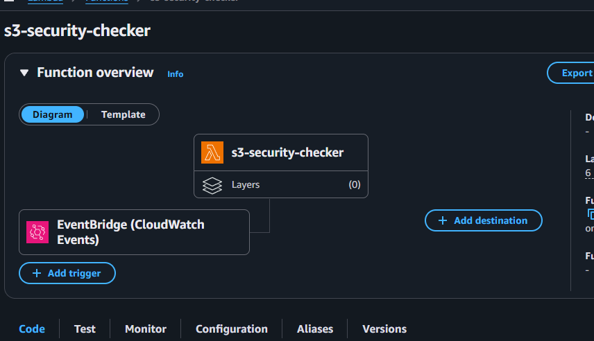
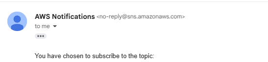

## Overview

We've finally reached the stage where we deploy our infrastructure using Terraform Cloud. This guide will walk you through creating, configuring, and deploying the necessary DevSecOps pipelines for your project.

## Configuration Steps

### Terraform Cloud Setup

1. Log into Terraform Cloud and select the **DSB organization**.
2. Click the **New** button to create a new project. Provide a name and description as needed.
3. Navigate to **Workspace**, select the project you created, and click **Continue**.
4. Choose **CLI-Driven Workflow** (required for GitHub Actions).
5. Enter the workspace name as `dsb-aws-devsecops-eks-cluster`. Add an optional description and click **Create**.
6. Repeat the same steps for another workspace named `dsb-aws-devsecops-pipelines`.

At the end of this process, you should have two workspaces created. Here’s an example of how they should appear in your organization (without the Run Status applied):


### Deploying Changes using Terraform

With the workspaces configured, you can now deploy changes using GitHub Actions.

1. Open your IDE and navigate to the project, and open a terminal session.
2. Change the email address in the Variables file and save it.
3. Within that terminal, at the root of the project, run these commands in order:
   
   ```bash
   $ terraform init
   ```

   :::tip
   Running the terraform init command will prompt you to log in to generate a token and is quite straightforward. Make sure you generate the token and paste it in the terminal to allow future actions.
   :::

4. Once your environment is initialized, then you want to apply your changes into your AWS account:

   ```bash
   $ terraform apply --auto-approve
   ```

   :::note
   This process should not take no longer than 5 minutes.
   :::

5. Confirm that the plans have been applied successfully. You should see a successful build in Terraform Cloud and resources created in AWS. Example results are shown below:

   **Local Deployment**:
   

   **Terraform Cloud Deployment**:
   

   **AWS Overview**:
   

6. Confirm the subscription for SNS so that you can receive emails:

   

With these steps completed, you are ready to test your detective control to see if it works.
